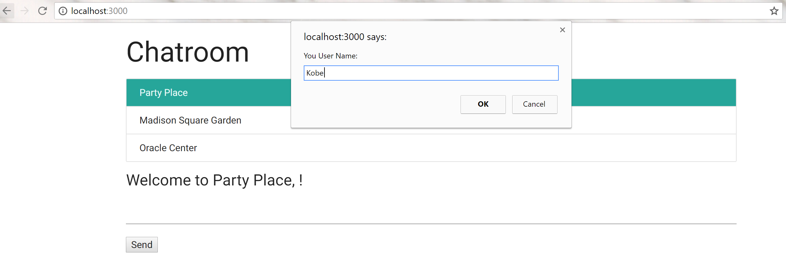
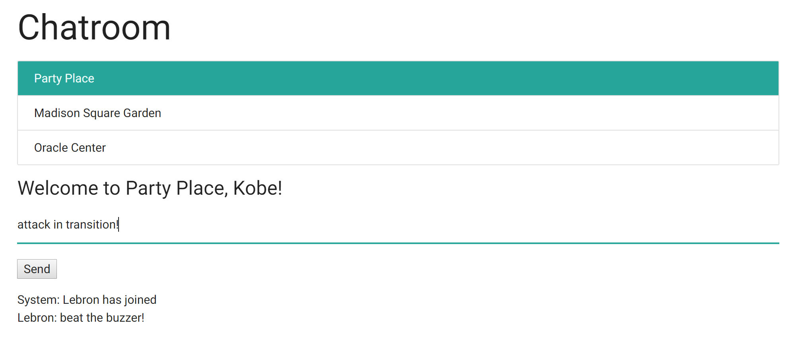
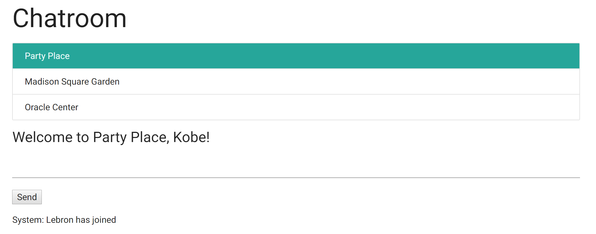
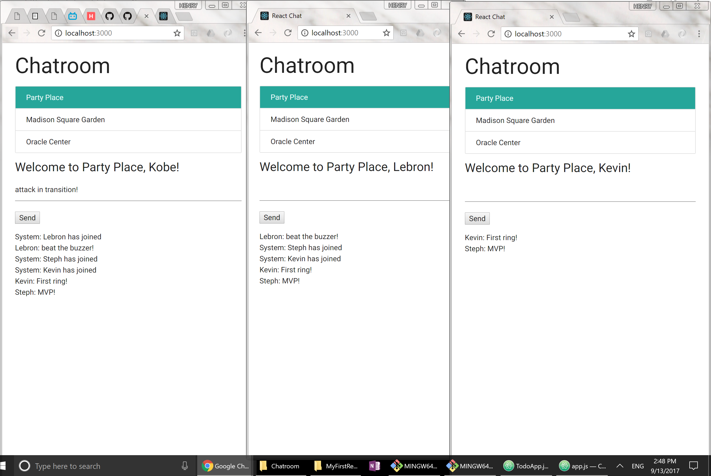

# Chatroom
Website where an infinite number of users can chat in distinct chatrooms

## Project Purpose

Needed a project to learn socketIO with. So I built this.

## Key Features

1. Join one of multiple chatrooms by setting a username

2. Chat with others in chatroom

3. Notified when new users join the chatroom

4. Allows infinite users in any channel

## Key Tools

socketIO

## Acknowledgments

* Horizons School of Technology
